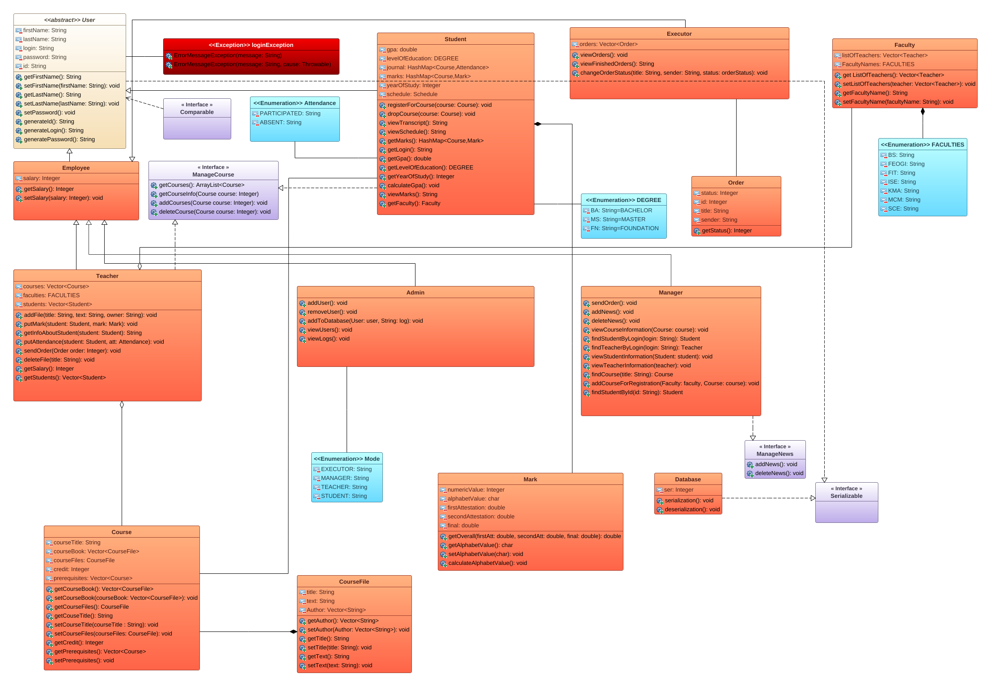
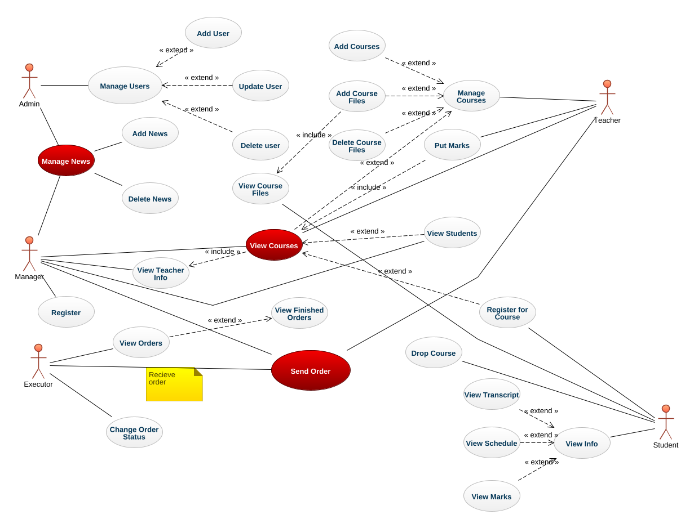

# University System

## Implemented miniature of University System by using four main Object-Oriented Programming Principles. Designed UML and Use-Case diagrams.

## Interaction with the User is done through console.